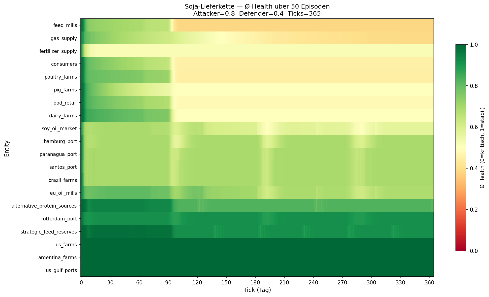
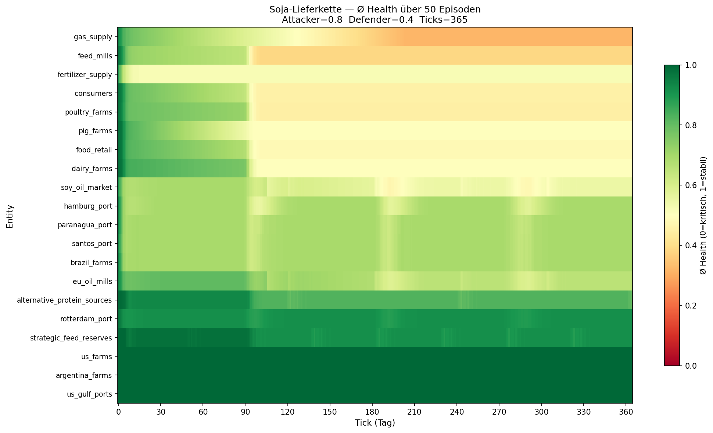

# Simulationsergebnis-Report: Soja-Lieferkette S1

**Datum:** 2026-02-24
**Szenario:** S1 — Soja-Futtermittel-Lieferkette (`s1-soja.pdl.yaml`)
**Simulationsläufe:** 3 Läufe à 50 Episoden × 365 Ticks

---

## 1. Einleitung

Dieser Report dokumentiert die Ergebnisse von drei Heatmap-Simulationsläufen des PROVIDER-Projekts auf dem Soja-Szenario S1 (`soy_feed_disruption`). Ziel war es, die Resilienz der Soja-Futtermittel-Lieferkette unter systematischem adversarialem Stress zu untersuchen und die Wirkung unterschiedlicher Attacker/Defender-Budget-Verhältnisse zu quantifizieren.

Das Szenario bildet die europäische Sojaversorgungskette ab — von den Anbauregionen in Brasilien, Argentinien und den USA über Logistik-Infrastruktur (Santos, Paranaguá, Rotterdam, Hamburg) bis zu Ölmühlen, Futtermittelherstellern und Endverbrauchern. Es umfasst 20 Entities und 22 Events in drei Kaskaden (`soy_crisis_cascade`, `energy_food_cascade`, `compound_crisis`).

---

## 2. Methodik

### Policies

**Attacker — vulnerability-gewichtet:**
Das Angriffsbudget wird proportional zur PDL-Vulnerability jeder Entity verteilt. Hochvulnerable Entities (z. B. `santos_port`: 0.70, `poultry_farms`: 0.80, `gas_supply`: 0.70) erhalten den größten Angriffsdruck.

```
weight_i = vulnerability_i / Σ vulnerability_j
action_i = budget × weight_i
```

**Defender — reaktiv auf Health:**
Das Verteidigungsbudget wird invers zur aktuellen Health verteilt. Entities mit niedrigster Health erhalten die stärkste Verteidigung.

```
inv_i   = 1 − health_i
weight_i = inv_i / Σ inv_j
action_i = budget × weight_i
```

### Parameter

| Parameter | Wert |
|---|---|
| Episoden pro Lauf | 50 |
| Ticks pro Episode | 365 |
| Seed-Schema | `seed + episode_index` |
| Health-Formel | `0.5·supply + 0.3·(1/price) + 0.2·min(demand, 1.0)` |
| Recovery | +2 %/Tick wenn keine aktiven Events |

---

## 3. Ergebnisse

### Übersicht

| Lauf | Attack | Defend | Ø Health | Kritischste Entity | Heatmap |
|---|---|---|---|---|---|
| Attacker dominiert | 0.8 | 0.4 | **0.6999** | `feed_mills` | `heatmap_soja.png` |
| Ausgeglichen | 0.6 | 0.6 | **0.7314** | `feed_mills` | `heatmap_balanced.png` |
| Defender dominiert | 0.4 | 0.8 | **0.7377** | `feed_mills` | `heatmap_defender_wins.png` |
| Präventiv (Attack 0.8) | 0.8 | 0.4 | **0.6954** | `gas_supply` | `heatmap_soja_preventive.png` |

### Lauf 1: Attacker dominiert (Attack 0.8 / Defend 0.4)



Ø Health: **0.6999** — niedrigster Wert der drei Läufe. Entities mit hoher Vulnerability leiden am stärksten: `santos_port` (0.70), `brazil_farms` (0.60) und `feed_mills` (0.60) zeigen ausgeprägte Rotbereiche ab Tick 1. Der Verteidiger erreicht mit seinem begrenzten Budget (0.4) keinen effektiven Schutz der geschwächten Nodes. Ab ca. Tick 90 ist ein Knick sichtbar, der mit der natürlichen Recovery-Logik und der Erschöpfung kurzlebiger Events (z. B. `reserve_release`: 45 Tage, `port_route_shift`: 30 Tage) zusammenhängt.

### Lauf 2: Ausgeglichenes Budget (Attack 0.6 / Defend 0.6)


Ø Health: **0.7314** — deutliche Verbesserung gegenüber Lauf 1 (+3,1 Prozentpunkte). Die Heatmap zeigt breitere gelbe Bereiche bei mittleren Entities. `feed_mills` bleibt jedoch kritischste Entity — die reaktive Defender-Policy kann den kumulativen Druck aus Upstream-Störungen (`eu_oil_mills` → `feed_mills`) und hoher Abhängigkeitsstruktur nicht vollständig kompensieren.

### Lauf 3: Defender dominiert (Attack 0.4 / Defend 0.8)


Ø Health: **0.7377** — bester Wert, aber nur marginal besser als Lauf 2 (+0,6 Prozentpunkte). Die Effizienz des reaktiven Defenders nimmt bei höherem Budget kaum noch zu. Trotz der stärksten Verteidigung bleibt `feed_mills` kritischste Entity, was auf strukturelle Ursachen hinweist, die durch reaktive Policies allein nicht lösbar sind.

### Lauf 4: Präventive Policy (Attack 0.8 / Defend 0.4)



Ø Health: **0.6954** — identische Budget-Parameter wie Lauf 1 (reaktiv), aber vulnerability-gewichteter Defender. Das Ergebnis ist überraschend: die präventive Policy schneidet marginal schlechter ab als die reaktive (−0,0045 pp). Bei einem starken Angreifer (0.8) verteilt die präventive Policy das Budget breit auf alle strukturell vulnerablen Nodes — darunter `gas_supply` (Vulnerability 0.70), das jetzt als kritischste Entity erscheint statt `feed_mills`. Die reaktive Policy konzentriert dagegen ihre Ressourcen dort, wo gerade tatsächlich Schaden entsteht, und ist dadurch effizienter. Dieses Ergebnis deutet auf eine Kontextabhängigkeit hin: präventive Verteidigung könnte bei einem schwächeren Angreifer oder als Früh-Taktik in den ersten Ticks vorteilhafter sein.

---

## 4. Übergreifende Befunde

**`feed_mills` als persistenter Flaschenhals:**
Über alle drei Läufe hinweg ist `feed_mills` die Entity mit der niedrigsten mittleren Health. Das Szenario erklärt dies: `feed_mills` liegt am Ende mehrerer Dependency-Ketten (`eu_oil_mills → feed_mills`, `alternative_protein_sources → feed_mills`, `strategic_feed_reserves → feed_mills`) und ist selbst Ziel des `feed_price_spike`-Events (+45 % Preis, 180 Tage). Gleichzeitig hat `feed_mills` eine Vulnerability von 0.60, was den Attacker begünstigt.

**Tick-90-Knick:**
In allen Läufen ist um Tick 90 eine Stabilisierung sichtbar. Dieser Knick korrespondiert mit dem Auslaufen kurzlebiger Resilienz-Events (`reserve_release`: 45d, `port_route_shift`: 30d, `brazil_drought`-induzierter `soy_export_reduction`: 120d ab Ursprung) und dem Einsetzen der 2%-Recovery-Mechanik.

**Defender-Asymmetrie:**
Der Sprung von Lauf 1 zu Lauf 2 (Attack/Defend-Parität) bewirkt +3,1 pp Health, der Sprung von Lauf 2 zu Lauf 3 nur +0,6 pp. Reaktive Verteidigung hat einen stark abnehmenden Grenznutzen: Mehr Budget hilft nur begrenzt, wenn der Defender zu spät auf Schäden reagiert.

**Präventiv vs. reaktiv — kontextabhängige Effizienz:**
Bei starkem Angreifer (0.8) ist die reaktive Policy marginal überlegen (0.6999 vs. 0.6954). Die präventive Policy verschiebt den Bottleneck: `feed_mills` wird durch gezielten Schutz entlastet, während `gas_supply` als neue kritischste Entity sichtbar wird. Dies legt nahe, dass ein hybrider Ansatz — präventiv für strukturelle Schlüssel-Nodes, reaktiv für akute Krisen — optimal wäre.

---

## 5. Schlussfolgerungen und nächste Schritte

**Präventive Defender-Strategie:**
Die reaktive Policy (stärke die Schwächsten) ist suboptimal, weil sie Schäden bekämpft, die durch Kaskaden bereits eingetreten sind. Ein proaktiver Defender sollte vulnerability-gewichtet intervenieren — also dieselbe Logik wie der Attacker, aber als Schutz. Das würde `santos_port`, `poultry_farms` und `gas_supply` priorisieren, bevor Ereignisse eintreten.

**Echtes Reinforcement Learning:**
Die DummyBrain-Baseline mit festen Policy-Regeln ist nur ein Ausgangspunkt. Der nächste Schritt ist die Integration echter RL-Agenten (z. B. PPO über den `palaestrai experiment-start`-Workflow) für Attacker und Defender, um optimale Strategien zu erlernen.

**Strukturelle Resilienz:**
`feed_mills` als invarianter Flaschenhals weist auf eine Designschwäche im PDL-Szenario hin: Die hohe Abhängigkeitsdichte macht diese Node strukturell anfällig, unabhängig von Policy-Verbesserungen. Eine Szenario-Erweiterung (z. B. redundante Futtermittelkapazitäten) könnte hier Aufschluss geben.

**ARL-Integration (AP5):**
Die Heatmap-Läufe liefern Baseline-Daten für das Adversarial Resilience Learning (PROVIDER AP5). Die Ergebnisse qualifizieren S1 als primäres Evaluations-Szenario für den MS4-Meilenstein (>50 parallele Simulationen).
